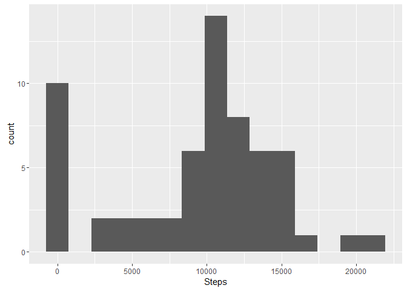
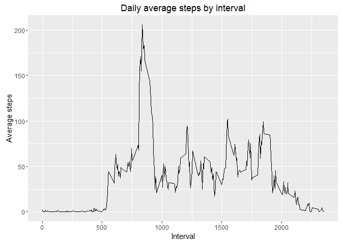
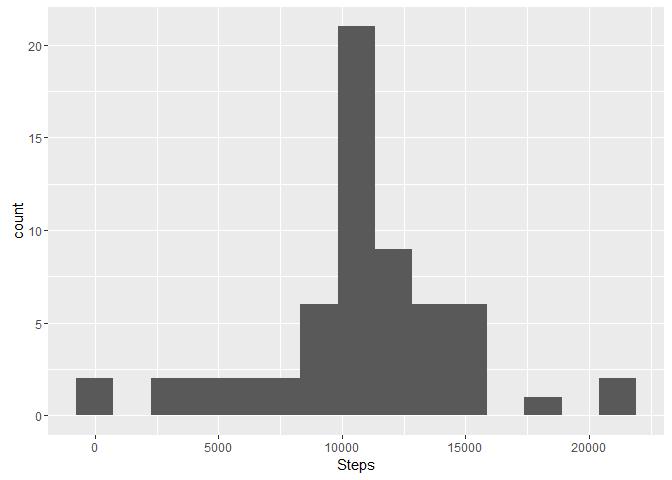
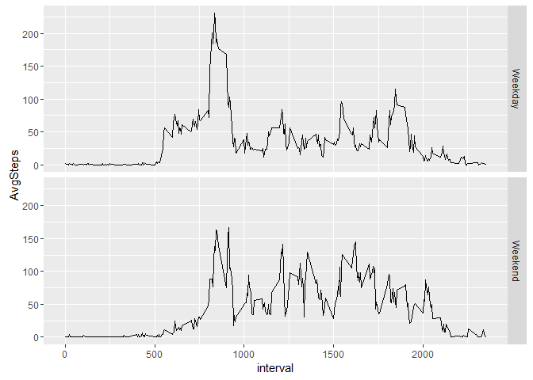
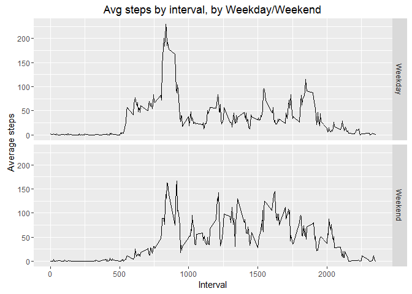

##Reproducible Research, Assignment 1

I'll be using the libraries dplyr & ggplot, so let's load them!


```r
library(dplyr)
library(ggplot2)
```

First, we unzip the file and load it to a data frame


```r
unzip("activity.zip")
data <- read.csv("activity.csv")
```

Once we have our data loaded, we can answer the assesment questions!

####1. What is mean total number of steps taken per day?
Based on the instructions, I'll remove the NA values for this question. First,
I'll get the totals per day


```r
dailySteps <- as.data.frame(data %>% 
                            group_by(date) %>%
                            summarise(Steps=sum(steps, na.rm=T))
                            )
print(dailySteps)
```

```
##          date Steps
## 1  2012-10-01     0
## 2  2012-10-02   126
## 3  2012-10-03 11352
## 4  2012-10-04 12116
## 5  2012-10-05 13294
## 6  2012-10-06 15420
## 7  2012-10-07 11015
## 8  2012-10-08     0
## 9  2012-10-09 12811
## 10 2012-10-10  9900
## 11 2012-10-11 10304
## 12 2012-10-12 17382
## 13 2012-10-13 12426
## 14 2012-10-14 15098
## 15 2012-10-15 10139
## 16 2012-10-16 15084
## 17 2012-10-17 13452
## 18 2012-10-18 10056
## 19 2012-10-19 11829
## 20 2012-10-20 10395
## 21 2012-10-21  8821
## 22 2012-10-22 13460
## 23 2012-10-23  8918
## 24 2012-10-24  8355
## 25 2012-10-25  2492
## 26 2012-10-26  6778
## 27 2012-10-27 10119
## 28 2012-10-28 11458
## 29 2012-10-29  5018
## 30 2012-10-30  9819
## 31 2012-10-31 15414
## 32 2012-11-01     0
## 33 2012-11-02 10600
## 34 2012-11-03 10571
## 35 2012-11-04     0
## 36 2012-11-05 10439
## 37 2012-11-06  8334
## 38 2012-11-07 12883
## 39 2012-11-08  3219
## 40 2012-11-09     0
## 41 2012-11-10     0
## 42 2012-11-11 12608
## 43 2012-11-12 10765
## 44 2012-11-13  7336
## 45 2012-11-14     0
## 46 2012-11-15    41
## 47 2012-11-16  5441
## 48 2012-11-17 14339
## 49 2012-11-18 15110
## 50 2012-11-19  8841
## 51 2012-11-20  4472
## 52 2012-11-21 12787
## 53 2012-11-22 20427
## 54 2012-11-23 21194
## 55 2012-11-24 14478
## 56 2012-11-25 11834
## 57 2012-11-26 11162
## 58 2012-11-27 13646
## 59 2012-11-28 10183
## 60 2012-11-29  7047
## 61 2012-11-30     0
```

Here is an histogram of the daily steps.

```r
qplot(Steps, data=dailySteps, geom="histogram", bins=15)
```

<!-- -->

Now lets calculate the mean and median.

```r
mean(dailySteps$Steps)
```

```
## [1] 9354.23
```

```r
median (dailySteps$Steps)
```

```
## [1] 10395
```

####2. What is the average daily activity pattern?

Here is a time series plot of the 5-minute interval and the average number of steps taken, 
averaged across all days.


```r
avgStepsbyInterval <- as.data.frame(data %>% 
                            group_by(interval) %>%
                            summarise(AvgSteps=mean(steps, na.rm=T))
                            )
g <- ggplot(avgStepsbyInterval, aes(x=interval, y=AvgSteps))
g <- g + geom_line() 
g <- g + labs(y="Average steps", x="Interval", title="Daily average steps by interval")
print(g)
```

<!-- -->

Below, we can see the 5 minute interval with the highest average.

```r
avgStepsbyInterval[which(avgStepsbyInterval$AvgSteps == max(avgStepsbyInterval$AvgSteps)),]
```

```
##     interval AvgSteps
## 104      835 206.1698
```

####3. Imputing missing values
Since there are several missing values, we are going to imput them, by substituting the NAs 
with the rounded average of the interval we got on the previous question. 
After that, we'll repeat the steps from the first question to compare the results.


```r
dataNoNulls <- data
dataNoNulls[is.na(dataNoNulls$steps),]$steps<- as.integer(avgStepsbyInterval[match( dataNoNulls[ is.na(dataNoNulls$steps), ]$interval, avgStepsbyInterval$interval), 2])

dailySteps <- as.data.frame(dataNoNulls %>% 
                            group_by(date) %>%
                            summarise(Steps=sum(steps, na.rm=T))
)

qplot(Steps, data=dailySteps, geom="histogram", bins=15)
```

<!-- -->

####4. Are there differences in activity patterns between weekdays and weekends?

First, we add a factor to determine if the date is weekday or not


```r
dataNoNulls$isWeekday <- weekdays(as.Date(dataNoNulls$date))
dataNoNulls$isWeekday <- as.factor(ifelse ( dataNoNulls$isWeekday %in% c("Saturday", "Sunday"), "Weekend", "Weekday"))
```

Then, we get the average by the new factor

```r
avgByIntervalWeekday <- as.data.frame(dataNoNulls %>% 
                            group_by(isWeekday, interval) %>%
                            summarise(AvgSteps=mean(steps, na.rm=T))
                            )
```

Finally, the results are plotted

```r
qplot(interval, AvgSteps, data=avgByIntervalWeekday, facets = isWeekday~., geom="line")
```

<!-- -->

```r
g <- ggplot(avgByIntervalWeekday, aes(x=interval, y=AvgSteps))
g <- g + facet_grid(isWeekday~.)
g <- g + geom_line() 
g <- g + labs(y="Average steps", x="Interval", title="Avg steps by interval, by Weekday/Weekend")
print(g)
```

<!-- -->
